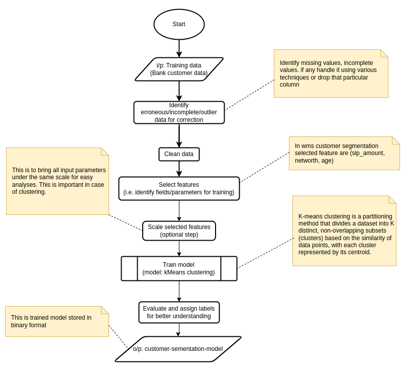
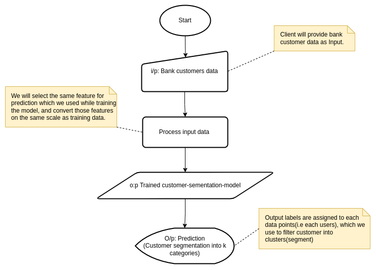

## README - WMS-Customer-Segmentation PoC

---

### Problem Statement

Customer segmentation aims to categorize account holders into distinct groups based on their characteristics, investments, and preferences. By understanding these segments, banks can tailor their services, marketing strategies, and communication to better meet the diverse needs of different customer groups.

### Implementation Process

To address the customer segmentation problem, we employed a clustering approach, specifically K-means clustering, which is a widely used method for grouping similar data points together. The objective is to identify homogeneous segments of account holders that share common traits.

**Following is the step of implementation:**

**Data Exploration:**
Loaded the dataset into a Pandas DataFrame and explored it. Checked for missing values and handled them appropriately. Examined the distribution of each feature to gain insights into the characteristics of the data.

**Data Preprocessing:**
Converted categorical variables to numerical format using encoding techniques, like categorical bining.

**Feature Selection:**
Identified the feature which can be used to segment the customer, selected those feature for training the model.

**Feature Scaling:**
We performed feature scaling to bring all the selected feature under same scale, so that no one feature dominates the model, and it is easy for us to understand the data on the same scale.

**Model Selection:**
Chose K-means clustering as the suitable machine learning model for customer segmentation. Determined the optimal number of clusters (K) through techniques like the elbow method.

**Model Training:**
Trained the K-means clustering model on the preprocessed dataset, assigning each account holder to a specific cluster based on their feature similarity.

**Segmentation Analysis:**
Analyzed the characteristics of each cluster to understand the unique attributes of different customer segments. Examined the distribution of features within each cluster to identify key differentiators.

---

### Flowchart Visualizations

To better understand the logic of training and prediction, below are screenshots of the end-to-end pipelines:

#### 📊 **Training Pipeline Flowchart**

This flowchart illustrates the journey from raw data ingestion through preprocessing, clustering, and evaluation.


#### 🔍 **Prediction Pipeline Flowchart**

This flowchart shows how new customer data is passed through the trained model to assign segment labels and generate insights.


---

### Setup Instructions

#### Step 1. Clone the `wms-customer-segmentation` Repository.

```
git clone https://github.com/varmor/wms-customer-segmentation
```

#### Step 2. Execute `docker-compose.yml` using following command.

```
docker compose up
```

#### Step 3. Test the PoC using the URL which will be displayed in the terminal.

```
wms-customer-segmentation-container  | 2024-02-08 07:36:39.464 
wms-customer-segmentation-container  | Warning: the config option 'server.enableCORS=false' is not compatible with 'server.enableXsrfProtection=true'.
wms-customer-segmentation-container  | As a result, 'server.enableCORS' is being overridden to 'true'.
wms-customer-segmentation-container  | 
wms-customer-segmentation-container  | More information:
wms-customer-segmentation-container  | In order to protect against CSRF attacks, we send a cookie with each request.
wms-customer-segmentation-container  | To do so, we must specify allowable origins, which places a restriction on
wms-customer-segmentation-container  | cross-origin resource sharing.
wms-customer-segmentation-container  | 
wms-customer-segmentation-container  | If cross origin resource sharing is required, please disable server.enableXsrfProtection.
wms-customer-segmentation-container  |     
wms-customer-segmentation-container  | 
wms-customer-segmentation-container  |   You can now view your Streamlit app in your browser.
wms-customer-segmentation-container  | 
wms-customer-segmentation-container  |   URL: http://0.0.0.0:8501
wms-customer-segmentation-container  |
```
